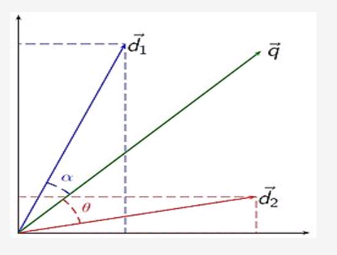
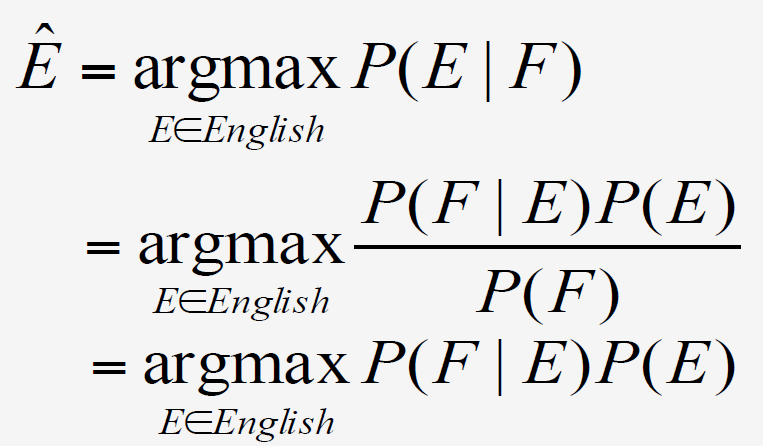

# Backrgound 2

[YouTube Video](https://www.youtube.com/watch?v=0X-n4Z1U9wI)

## Theoretical Computer Science

* Automata
  * Deterministic and non-deterministic finite-state automata
  * Push-down automata
* Grammars
  * Regular grammars
  * Context-free grammars
  * Context-sensitive grammars
* Complexity
* Algorithms
  * Dynamic programming

## Mathematics and Statistics

* Probabilities
* Statistical models
* Hypothesis testing
* Linear algebra
* Optimization
* Numerical methods

## Mathematical and Computational Tools

* Language models
* Estimation methods
* Context-free grammars (CFG)
  * for trees
* Hidden Markov Models (HMM)
  * for sequences
* Conditional Random Fields (CRF)
* Generative/discriminative models
* Maximum entropy models

## Statistical Techniques

* Vector space representation for WSD

how different documents can be represented as vectors in a vector space so we have here two documents D 1 and D 2 and a query Q all three of those are represented as vectors and we can  determine which of the two documents do you want or D 2 is more similar to the query Q by looking at the angle between that document and the query so the angle between D 1 and Q is alpha the angle between D 2 and Q is Theta and in this case it's pretty obvious that theta is a larger angle than alpha and therefore a document 1 is actually a better match to the query Q.

* Noisy channel models for MT

The so-called noisy channel model for machine translation it is based on an idea that originated in speech processing and the idea is very simple we assume that when we have two languages and we want to translate between them we assume that one of the languages is an encoded version of the other  language so if we want to translate some text from French to English we are going to try to identify which string in English is most likely given the French string and this is then converted using the `Bayesian theorem` into the second expression, and then it's also simplified into the third expression knowing that the probability of the French sentence does not change when you change the English sentence so you can just assume that for ranking purposes the sentence in english that maximizes the conditional probability of e given F can be computed the same way even  if you didn't know the value of the probability of the French settlers

* Graph-based Random walk methods for sentiment analysis

Third technique that is used in natural language processing that originates in statistics is the so called a `random walk method`, it takes a graph and uses what is known as a `Monte Carlo simulation` to label the nodes of the graph using different values so this is useful for tasks in natural language processing such as sentiment analysis where you have as input the sentence that can be either positive or negative and then you want to label some additional sentences as either a negative or positive by looking at the examples that you have seen so far.

## Aritifical Intelligence

* Logic
  * First-order logic
  * Predicate calculus
* Agents
  * Speech acts
* Planning
* Constraint satisfaction
* Machine learning

Next [Linguistics](01_07_Linguistics.md)