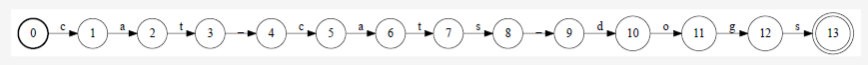
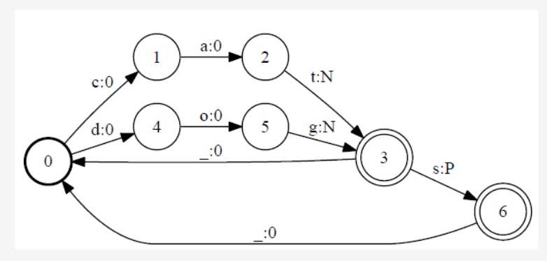

# Background

[YouTube Video](https://www.youtube.com/watch?v=0X-n4Z1U9wI)

## Linguistic Knowledge

* **Constituents**: `Constituent` - it is a unit of the syntax of a sentence that has a specific whole. Ex: below
    * __Children__ eat pizza or __They__ eat pizza. The underline fragment indicates the subject of the sentence, those can be replaced with each other the sentence would still be grammatical. Another Ex below.
    * __My cousin's neighbors children__ eat pizza. Here also the underline is subject of the sentence, they have something in common, here it is they are all `noun phrases`, and the length actually doesn't matter. Another Ex:
    * Eat Pizza! - Here the subject is not specified(imperative), but the way the sentence is been said, here it is `You` are the implicit subject.
* **Collocations**: collocations are groups of words that appear more frequently together than you would expect by chance and typically have some specific meaning. Ex: Below
    * Strong beer but *powerful beer - we can say that some beer is strong but we cannot say that that beer is powerful so two synonyms cannot be always interchangeable.
    * Big sister but *large sister - you can say that this is my big sister, but you cannot say this my large sister, even though big and large are synonyms.
* **How to get this knowledge in the system**: 
    * Manual rules - Ex: `big sister` means this and `large sister` means completely different, and encode those rules by hand in the system. Or
    * Automatically acquired from large text collections (corpora)
* **Knowledge about language**:
    * Phonetics and phonology - the study of sounds - example what are consonants and vowels and which consonants are stops versus fricatives
    * Morphology - the study of word components - example in the word `impossible`, `im` is a prefix that means negation and impossible means something that is not possible.
    * Syntax - the study of sentence and phrase structure - what is the `subject` of the sentence, what is the `object`, what is the `verb`
    * Lexical semantics - the study of the meanings of individual words.
    * Compositional semantics - how to combine words and segments of sentences and to understand the meaning of the combined sentence.
    * Pragmatics - how to accomplish goals
    * Discourse conventions - how to deal with units larger than utterances - Ex: you can have a multi sentential paragraph where each additional sentence somehow referes to first sentence by using pronouns and other forms of reference.

## Computer Science - Finite-state Automata

Finite-state Automata is a machine that consists of states and transitions one of the states is the start state and we can also have one or more final or accept states. See pic below.

Here state zero is the start state it's indicated by a solid line circle and state number thirteen is an accept state and that is denoted by the double circle, the transitions go as follows state zero(0) to state one(1) you have the letter **C**, from state 1 to state 2 you have the letter **A**, from state 2 to state 2 you have the letter **T**, then there is a space from 3 to 4 and so on, so the whole automaton here is used to encode the sequence of three words **cat** **space** **cats** **space** **dogs**.

Another automaton known as transducer can be then combined with the previous automaton to perform some sort of phonological or morphological analysis of the sentence, see pic below.

The above automaton starts in state zero, and then it has multiple paths so let's look at them in detail, the top path has three consecutive edges, the first edge converts `C` to a `zero`(0) whereas `zero` indicates the empty string, then the next edge is from `one`(1) to `two`(2) it takes as input the letter `A` and it produces the empty string as output, and finally the third transition
goes from state `2` to state `3` it needs in a letter `T` and it produces a capital `N` and then it goes to state number `3` which is an acceptable final state so if we perform a specific operation on the two automata that you can see on the screen that specific operation is called **composition** what is going to happen is that we're going to read the `c`, `a` and `t` from the input on top and convert that sequence into the sequence empty string followed by empty string followed by capital `N` so in a sense we did a very simple `morphological analyzer` or `Part Of Speech(POS) tagger` we labeled the word `cat` as a `Noun`.

If the input string `cat` had stopped right there we would have been in an accept state number `3` and we would have just produced the `Noun` label and stopped, however our input contains three words and the above automaton has the capability of processing all those three words and producing the correct labels for them, so let's see if we can trace it so we already did the part where we look at `c`,`a`,`t` and we label this as a `Noun` and now the next symbol on the input is a `space` well the `space` takes us from state `3` to state `0` and doesn't produce any output, so we can essentially go back to the beginning then we have `c`,`a`,`t`,`s` in the second automaton that takes us to the same path as before and we produce an capital `N` from state 0 to state 1 to state 2 and to state 3 but then `s` now takes us to state 6 but now we're going to produce a capital `P` on the output, that tells us that the word `cats` is `Noun Plural`.

We could stop here, but since there is more input to process we have to go back from state `6` to the beginning state `0` the input is an empty string, we got a `space` in this case and the output is an `empty string` let us go back to state `0` and we have now the word `dogs` so this is process by going from state `0` to state `4` then to state `5` then to state `3` in which case we output the letter `N` then we have one more letter in the input the letter `s` which gets translated into a capital `P` and now at this point both the input string and the so called transducer are in an accept state therefore we can stop.

The first label comes from the input and the second label comes from the `transducer` so if we read it left to right by only focusing on the first label on each edge we're going to get the original string which is `cat` `space` `cats` `space` `dogs`.

Now if we read the second label in each transition we're going to produce the output of this para  speech tagger so let's try to do this here `empty string` `empty string` capital `N` which is the  label for `cat` as `Noun`.

Followed by `empty string` `empty string` `empty string` capital `N` capital `P` which is the label for the word `cats` as a `Noun Plural`.

Followed by a few `empty strings`, followed by a capital `N` and capital `P` which is the label for the `Noun Plural` `dogs` so this point in time the `transducer` has finished its work and we can just produce the output which consists of the second labels on every transition so `N` `N` `P` `N` `P` this was just a small illustration how techniques that come from theoretical computer science such as finite state automata are used in **Natural Lnguage Processing**

TODO

Next [Background 2](01_06_02_Background.md) 
