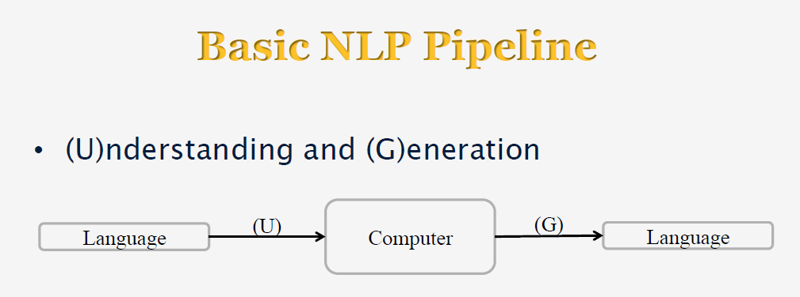

# Introduction

Natural Language Processing (NLP) is the study of the computational treatment of natural (human) language.

In other words, teaching computers how to understand (and generate) human language.

NLP draws on research in Linguistics, Theoretical Computer Science, Mathematics, Statistics, Artificial Intelligence, Psycology, Databases, etc.

## Language and Communication

* Speaker
    - Intention (goals, shared knowledge and beliefs)
    - Generation (tactical)
    - Synthesis (text or speech)
* Listener
    - Perception
    - Interpretation (syntactic(grammatical structure of the sentence), semantic(meaning of sentence), pragmatic(purpose of the sentence))
    - Incorporation (internalization, understanding) - take some action or learn something based on what the speaker said.
*  Both
    - Context (grounding) - known as Part of Grounding in linguistic theory.

## Basic NLP Pipeline

[YouTube Video](https://www.youtube.com/watch?v=n25JjoixM3I)

Next [Examples Of Text](01_02_examples_of_text.md)