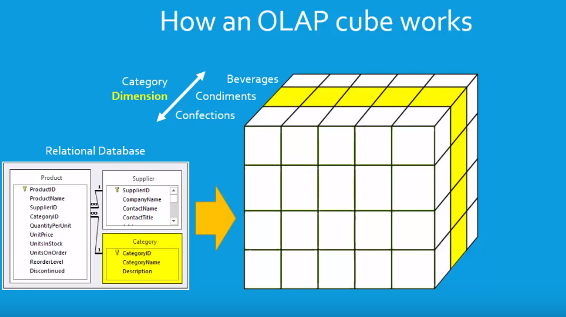
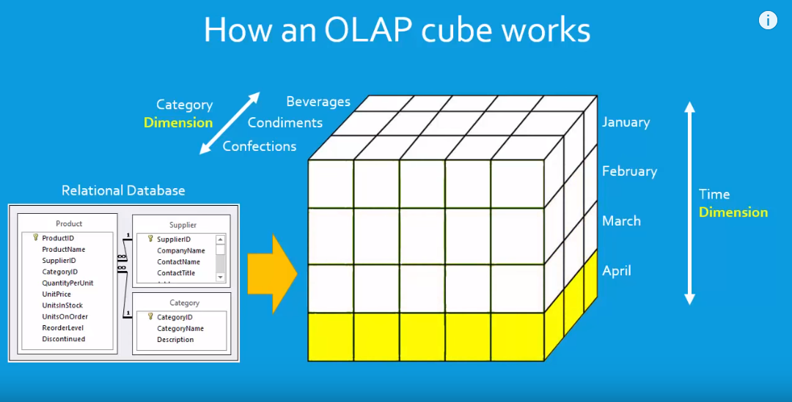
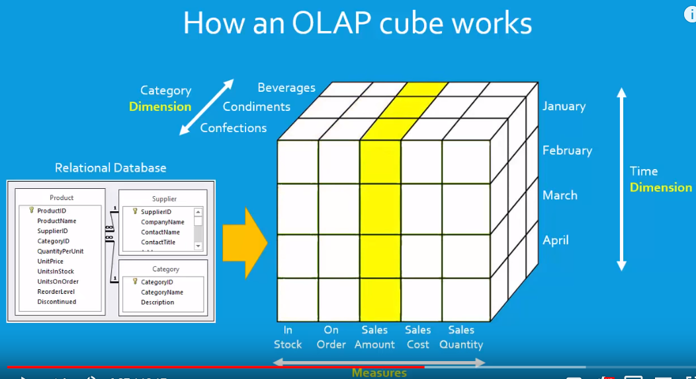
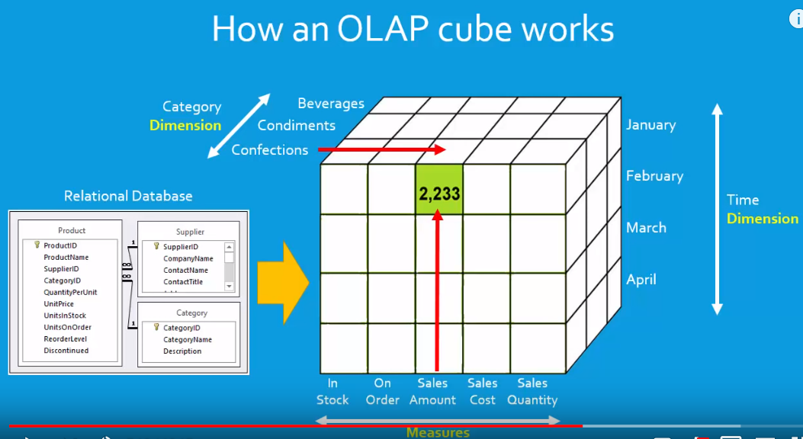

# OLAP - On-Line Analytical Processing

OLAP Cube

1. Dimensions - 

lets take the relation database table

Category (table name)
  - CategoryID
  - CategoryName 
  - Description

Now the Category table has the different values and unqiuely of 3?
a) Beverages b) Condiments c) Confections

Now in the below cube of it is showing for condiments

Taking another dimension as time
a) January, b) February, c) March, d) April

and we are looking at April slice below.

2. Measures

Taking the measuring values lets say by
a) In Stock b) On Order c) Sales Amount d) Sales Cost and e) Sales Quantity

and we are looking at Sales Amount

3. Lets put a value in one of the cells and see how we retrieve and understand it.

it when you retrieve a value from an OLAP cube the value is said to be at a
cube intersection that is an intersection of a measure and dimensions
I can see that the measure this time is the `Sales Amount` so the `2233`
is the total amount of sales at some point then I can see that this is in the
`January` slice so I know that `2233`, involves sales rolled up in `January` and
then I can see it's in the confections dimension so I know this is sales for
confections in `January` and it's a sales amount so `2233` is the `total sales amount in January in the confections category`

4. Heirarchies

The Heirarchies come into picture when we have parents and children.

Example:

On the `Time` dimension assuming the current shown months are from 2019, so parent here it is 
2019 and we have children Jan, Feb ...

And lets say we have weeks on any of the month, then the month Ex: Jan becomes the parent
and the week becomes the children and it is a heirarchy.

And we can always get measure value of the parent by summing up all the children.

5. MDX language or Multi-dimensional Expression Language

We use MDX queries to retrieve data from the OLAP cube.