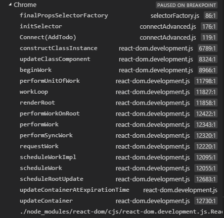

* Application start Container -> Component -> connect flow

    react-redux/connect/connect.js

    ```js
    export function createConnect() {
        return function connect(mapStateToProps, mapDispatchToProps, mergeProps) {
    ```

    ```js
    var initMapStateToProps = match(mapStateToProps, mapStateToPropsFactories, 'mapStateToProps');
    var initMapDispatchToProps = match(mapDispatchToProps, mapDispatchToPropsFactories, 'mapDispatchToProps');
    var initMergeProps = match(mergeProps, mergePropsFactories, 'mergeProps');
    ```

* Page refresh flow

    // Redux Related
    first combineReducers function call in "index.js" in "reducers"

    ```js
    export default combineReducers({
        todos,
        visibilityFilter
    })
    ```
    combineReducers is in "node_modules/redux/es/combineReducers.js"

    ```js
    assertReducerShape(finalReducers);
    ```

    then went to "todo.js" under reducers, with action.type = "@@redux/INIT" and also with type random
    then went to "visibilityFilter.js" under reducers, same as for "todo.js"

    return function comnation() gets returned when imported using
    ```js
    export default combineReducers({
        todos,
        visibilityFilter
    })
    ```
    now the combination() is the "rootReducer" in src\index.js
    ```js
    import rootReducer from './reducers'
    ```

    Executing createStore by passing rootReducer
    ```js
    const store = createStore(rootReducer)
    ```

    redux/es/createStore.js -> createStore method

    ```js
    dispatch({ type: ActionTypes.INIT });
    ```

    createStore function returns the Object with dispatch, subscribe, getState, replaceReducer and others

    // React related now for rendering

    src/index.js

    ```js
    render(
        <Provider store={store}>
            <App />
        </Provider>,
        document.getElementById('root')
    )
    ```

    note: A component contain other compnents included and also other containers

    Now App will try to execute, in which it internally calls AddTodo, VisibleTodoList, Footer

    VisibleTodoList has two functions are passed as parameters to connect (import { connect } from 'react-redux')

    -----------------

    In index.js


    ```js
    render(
        <Provider store={store}>
            <App />
        </Provider>,
        document.getElementById('root')
    )
    ```

    react-dom/cjs/react-dom.development.js

    ```js
    render: function (element, container, callback) {
        return legacyRenderSubtreeIntoContainer(null, element, container, false, callback);
    }
    ```

    ```js
    function legacyRenderSubtreeIntoContainer

        DOMRenderer.unbatchedUpdates
    }
    ```

    DOMRenderer.unbatchedUpdates is from base of

    <REFER_HERE>
    ```js
    function unbatchedUpdates(fn, a) {
    ```
    - var ReactFiberScheduler = function (config) {
        unbatchedUpdates: unbatchedUpdates
    
    - var ReactFiberReconciler$1 = function (config) {
        _ReactFiberScheduler = ReactFiberScheduler(config)

    - var ReactFiberReconciler$2 = Object.freeze({
        default: ReactFiberReconciler$1
    });

    - var ReactFiberReconciler$3 = ( ReactFiberReconciler$2 && ReactFiberReconciler$1 ) || ReactFiberReconciler$2;

    - var reactReconciler = ReactFiberReconciler$3['default'] ? ReactFiberReconciler$3['default'] : ReactFiberReconciler$3;

    - var DOMRenderer = reactReconciler({

    here the unbatchedUpdates attached

    <REFER_HERE>
    ```js
    function unbatchedUpdates(fn, a) {
        ...
        return fn(a);
    ```

    ```js
    DOMRenderer.unbatchedUpdates(function () {
        ....
        root.render(children, callback);
    ```

    ```js
    ReactRoot.prototype.render = function (children, callback) {
        ...
        DOMRenderer.updateContainer(children, root, null, work._onCommit);
    ```

    ```js
    updateContainer: function (element, container, parentComponent, callback) {
        return updateContainerAtExpirationTime(element, container, parentComponent, currentTime, expirationTime, callback);
    ```

    ```js
    function updateContainerAtExpirationTime(element, container, parentComponent, currentTime, expirationTime, callback) {
        ...
        return scheduleRootUpdate(current, element, currentTime, expirationTime, callback);
    ```

    ```js
    function scheduleRootUpdate(current, element, currentTime, expirationTime, callback) {
       scheduleWork(current, expirationTime); 
    ```

    And more can be seen in the call stack image
    
     


* Click on "Add todo" button flow

    It is a form , generates form submit action

    calls "addtodo" action in index.js under "actions" folder

    returns a new JSON object as action

    calls "dispatch" function in "createStore.js" in node_modules\redux\es\

    which calls currentReducer which got populated as combination function from combineReducer.

    Now reducer does its purpose which is it takes state and action as input and gives the next state.

    we have two reducers we registerd initially
    first reducer "todos" calls with 

    state = [], action= {"type":"ADD_TODO","id":0,"text":"pradeep"}

    now adds by going to case 'ADD_TODO' based on action type

    returns [{"type":"ADD_TODO","id":0,"text":"pradeep"}]

    Next reduer "visibitilyFilter" calls with

    state = "SHOW_ALL" same as action above

    since that action is not mapped in switch case of "visibitilyFilter" it returns default

    after currentReducer we have listeners, in which one of it is "onStateChanged"

    which is in connectAdvanced.js 

    it calls run -> makeSelectorStateful -> run -> sourceSelector as pureFinalPropsSelector in 

    selectFactory selectorFactory.js react-redux/es/connect/ 
    
    handleSubSequentCalls -> calls "handleNewState" function

    which calls "mapStateToProps" which is for our "getVisibleTodos" in VisibleTodoList container

    it compares previous state and new state and get properties (TODO - need further)
    via state we are updating the properties

    Now the control goes to FilterLink.js

    ..... missing some doc in middle

    Todo -> react-dom.development.js -> mountIndeterminateComponent func


* Clicking on Filters. Clicked on Active

    in FilterLink.js
    ```js
    onClick: () => dispatch(setVisibilityFilter(ownProps.filter))
    ```

    triggers dispatch function in redux/ex/createStore.js

Dispatch (`dispatch()`) takes `action` as input, gets the `currentState` (first time its get populated with `INIT` action which makes sure all reducers return the default initial state )