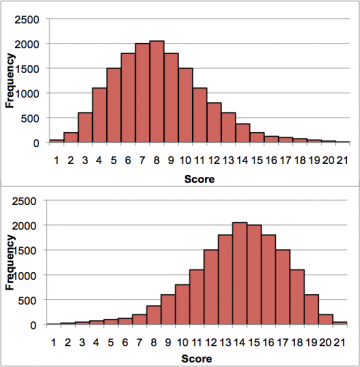
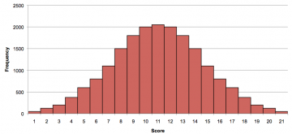

# Statistics

## Mean (mu)

Mean is "Average" value of the data. i.e add up all the values in the data set and then divide
 by the number of values that we added

## Variance (sigma square)

How much the numbers are spread out and how far are they from mean.

## Standard Deviation (sigma)

Square root of `Variance`

## Gaussian or Normal Distribution

In a continuous graph, data can be spread out in different ways. Either it can spread to left, or to left or jumbled up.

But there are many cases where data tends to be around a cental value with no bias left or right and the resulting distribution is called a normal distribution or a gaussian or a bell's curve.

Normal distribution is helpful for [Kalman Filters](https://github.com/pktippa/ai-training/blob/master/machine-learning/kalman_filters.md)

In Normal distribution we need to define a range, Ex: what is the probability of getting rain between 4.5 to 5.5 cms.

We mark the points and we calculate the area under these points which gives us the probability.

The `mean`, `median` and `mode` for this distribution all are equal.